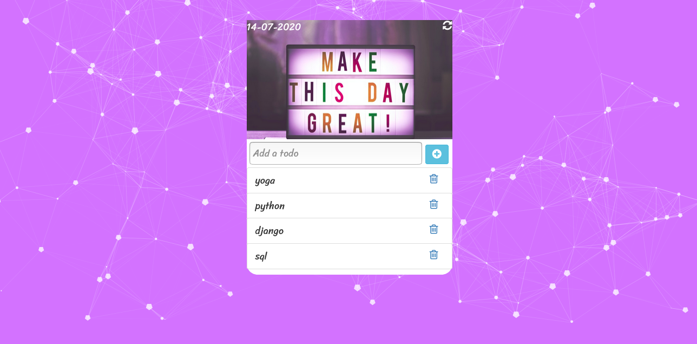

# TodoApp
<h1>Introduction</h1>

A a simple Todo application built in Django (including the Django REST Framework for API CRUD operations)

<h1>Built With</h1>

<ul>
  <li><a href="https://www.python.org/">Python</a> - A programming language that lets you work quickly and integrate systems more effectively.</li>
  <li><a href="http://djangoproject.org/">Django</a> - A high-level Python Web framework that encourages rapid development and clean, pragmatic design.</li>
</ul>

